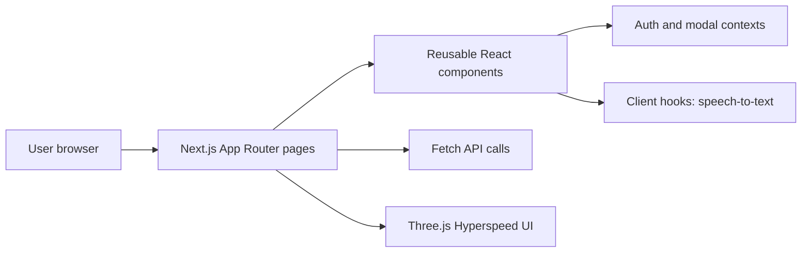
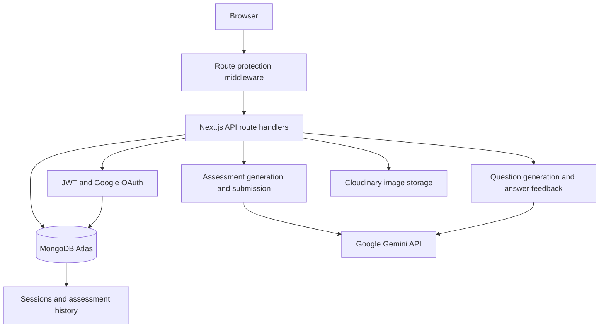
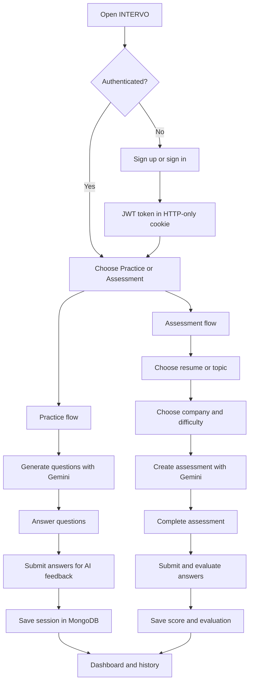

# INTERVO

### AI-powered interview preparation platform

INTERVO is a full-stack web application for practicing technical interviews with AI-generated questions and instant answer evaluation. A user can create an account, choose a topic or upload a resume, attempt an assessment, receive feedback, and review progress from the dashboard.

**Live application:** [https://intervo-azure.vercel.app](https://intervo-azure.vercel.app)

## Contents

- [Project Overview](#project-overview)
- [Features](#features)
- [Tech Stack](#tech-stack)
- [Architecture](#architecture)
- [Application Flow](#application-flow)
- [Screens and Outputs](#screens-and-outputs)
- [Folder Structure](#folder-structure)
- [Installation and Setup](#installation-and-setup)
- [Challenges and Solutions](#challenges-and-solutions)
- [Future Scope](#future-scope)

## Project Overview

### Problem

Interview preparation is often unstructured. Candidates need relevant questions, feedback on their answers, and a way to measure improvement over multiple sessions.

### Solution

INTERVO combines an interactive practice experience with an AI assessment engine. It stores attempts and scores so users can move from one-off practice to measurable preparation.

### Quick walkthrough

1. Open the [live application](https://intervo-azure.vercel.app) or run it locally.
2. Create an account or sign in with Google.
3. Open **Practice** to generate questions for a selected topic and difficulty.
4. Answer questions and submit the session for AI feedback.
5. Open **Assessment** to create a structured assessment from a topic or resume.
6. Review the result, score breakdown, strengths, improvements, and recommendations.
7. Use **Dashboard** and **Assessment History** to track performance over time.
8. Manage username, password, and profile image from **Profile**.

## Features

- Email/password authentication with JWT cookies
- Google OAuth sign-in
- Protected application routes and persistent sessions
- AI-generated interview questions using Google Gemini
- Topic-based and resume-based assessments
- Difficulty selection: easy, medium, and hard
- Multiple-choice and custom question support
- AI evaluation with scores, feedback, strengths, improvements, and recommendations
- Session history and dashboard analytics
- Profile username and password management
- Profile image upload through Cloudinary
- MongoDB persistence for users, sessions, and assessments

## Tech Stack

| Area | Technologies |
| --- | --- |
| Frontend | Next.js 16 App Router, React 19, TypeScript, Tailwind CSS 4 |
| Backend | Next.js Route Handlers, REST-style API endpoints |
| AI | Google Gemini through `@google/generative-ai` |
| Database | MongoDB Atlas, Mongoose |
| Authentication | JWT, bcryptjs, Google OAuth 2.0 |
| File storage | Cloudinary |
| UI / visual effects | Tailwind CSS, Three.js, postprocessing |
| Deployment | Vercel |
| Quality tooling | ESLint, TypeScript |

## Architecture

### Frontend architecture



The frontend is organized around route-level pages in `src/app`, reusable UI in `src/components`, and shared auth state in `src/context`. Client pages call the internal API routes rather than accessing databases or provider secrets directly.

### Backend architecture



API handlers authenticate the request, validate input, call the relevant service, and persist the result. Gemini is used for question generation and feedback; MongoDB stores users, sessions, and assessment attempts; Cloudinary stores profile images.

### Main API surface

| Capability | Endpoint(s) |
| --- | --- |
| Auth | `/api/auth/signup`, `/api/auth/signin`, `/api/auth/logout`, `/api/auth/google`, `/api/auth/google/callback` |
| User profile | `/api/auth/profile`, `/api/auth/update-username`, `/api/auth/change-password`, `/api/auth/upload-profile-image` |
| Practice | `/api/generate`, `/api/feedback`, `/api/sessions` |
| Assessments | `/api/assessment`, `/api/assessment/[attemptId]`, `/api/assessment/[attemptId]/submit`, `/api/assessment/history` |
| Database check | `/api/test-db` |

## Application Flow



## Screens and Outputs

The deployed app contains these main screens. The output column describes what a user should see after the relevant action.

| Screen | Route | Expected output |
| --- | --- | --- |
| Landing page | `/` | Product introduction, animated visual background, and links to practice or dashboard |
| Home | `/home` | Authenticated home experience with navigation |
| Practice | `/practice` | Generated interview questions, answer controls, submit action, and AI feedback |
| Assessment setup | `/assessment` | Intake mode, resume/topic input, company selector, and difficulty selector |
| Assessment attempt | `/assessment/attempt/[attemptId]` | One structured assessment attempt with questions and answer submission |
| Assessment result | `/assessment/result/[attemptId]` | Score, summary, strengths, improvements, recommendations, and readiness information |
| Assessment history | `/assessment/history` | Previous attempts with status, company, difficulty, score, and dates |
| Dashboard | `/dashboard` | Session totals, average/best performance, recent activity, and practice links |
| Profile | `/profile` | Account details, username/password controls, and profile image upload |
| Auth modal/pages | Auth components | Sign in, sign up, OTP-related UI, and Google sign-in entry point |

> The repository currently contains no captured screenshot assets. To add visual screenshots, save them under `public/screenshots/` and add them to this table with Markdown image links after capturing the deployed screens.

## Folder Structure

```text
INTERVO/
├── public/                         # Static assets
├── src/
│   ├── app/                        # App Router pages and API routes
│   │   ├── api/                    # Backend route handlers
│   │   ├── assessment/             # Assessment setup, attempt, result, history
│   │   ├── dashboard/              # Analytics dashboard
│   │   ├── home/                   # Authenticated home page
│   │   ├── practice/               # Practice session UI
│   │   ├── profile/                # User profile UI
│   │   ├── components/             # App-local components and auth UI
│   │   ├── globals.css             # Global styles
│   │   ├── layout.tsx              # Root layout and metadata
│   │   └── page.tsx                # Landing page
│   ├── components/                 # Shared UI and assessment components
│   ├── context/                    # Auth and auth-modal state
│   ├── hooks/                      # Reusable client hooks
│   ├── lib/                        # Auth, OAuth, DB, AI, storage, helpers
│   └── models/                     # Mongoose User, Session, Assessment models
├── middleware.ts                   # JWT-based route protection
├── next.config.ts                  # Next.js configuration
├── package.json                    # Scripts and dependencies
├── eslint.config.mjs               # ESLint configuration
├── postcss.config.mjs              # Tailwind/PostCSS configuration
└── tsconfig.json                   # TypeScript configuration and path aliases
```

## Installation and Setup

### Prerequisites

- Node.js 20 or later
- npm
- MongoDB Atlas database
- Google Gemini API key
- Cloudinary account for profile image uploads
- Google Cloud OAuth credentials if Google sign-in is enabled

### Local setup

```bash
git clone https://github.com/Hks100524/INTERVO.git
cd INTERVO
npm install
```

Create a `.env.local` file in the project root:

```env
MONGODB_URI=mongodb+srv://<username>:<password>@<cluster>/<database>
JWT_SECRET=replace-with-a-long-random-secret
GEMINI_API_KEY=your-gemini-api-key

CLOUDINARY_CLOUD_NAME=your-cloud-name
CLOUDINARY_API_KEY=your-cloudinary-api-key
CLOUDINARY_API_SECRET=your-cloudinary-api-secret
CLOUDINARY_FOLDER=profiles

GOOGLE_CLIENT_ID=your-google-client-id
GOOGLE_CLIENT_SECRET=your-google-client-secret
GOOGLE_REDIRECT_URI=http://localhost:3000/api/auth/google/callback
```

For Google OAuth, add the redirect URI above to the OAuth client in Google Cloud Console. For production, use the deployed domain callback URL and configure the same variables in Vercel. Never commit `.env.local` or provider secrets.

Run the project:

```bash
npm run dev
```

Open [http://localhost:3000](http://localhost:3000). The other available scripts are:

```bash
npm run lint       # Run ESLint
npm run build      # Create a production build
npm run start      # Start the production server
```

## Challenges and Solutions

| Challenge | Solution |
| --- | --- |
| Keeping AI output usable by the UI | Prompt helpers and response parsing normalize generated questions into a typed assessment shape. |
| Protecting user data | JWT verification is centralized and API handlers validate the authenticated user before reading or writing records. |
| Supporting different preparation styles | The assessment wizard supports both resume-based and topic-based intake with configurable company and difficulty. |
| Persisting progress across sessions | Mongoose models and dedicated session/assessment data helpers store attempts and evaluations in MongoDB. |
| Handling profile media | Cloudinary is used for hosted image storage instead of keeping large files in MongoDB. |
| Making a rich visual UI work with Next.js rendering | The Three.js-based Hyperspeed effect is dynamically imported with SSR disabled. |
| Keeping evaluation results actionable | Results expose more than a score: summary, strengths, improvements, recommendations, readiness, and score breakdown. |

## Future Scope

- Add role-specific interview tracks for frontend, backend, data, DevOps, and system design.
- Add live voice/video mock interviews with speech analysis and turn-taking.
- Add adaptive difficulty based on recent scores and weak topics.
- Add question bookmarking, search, tags, and a personal question bank.
- Add richer analytics such as topic-wise trends and time-to-answer metrics.
- Add admin tooling for managing prompts, question quality, and moderation.
- Add automated tests for API handlers, auth flows, AI response parsing, and critical user journeys.
- Add rate limiting, request observability, and provider-failure fallbacks for production scale.
- Add accessibility auditing and localization for a wider learner audience.

## Contributing

1. Create a feature branch.
2. Install dependencies and configure `.env.local`.
3. Run `npm run lint` and `npm run build` before opening a pull request.
4. Describe the user-facing behavior and any required environment variables in the pull request.

## License

No license file is currently included in the repository. Add a license before distributing the project publicly.
